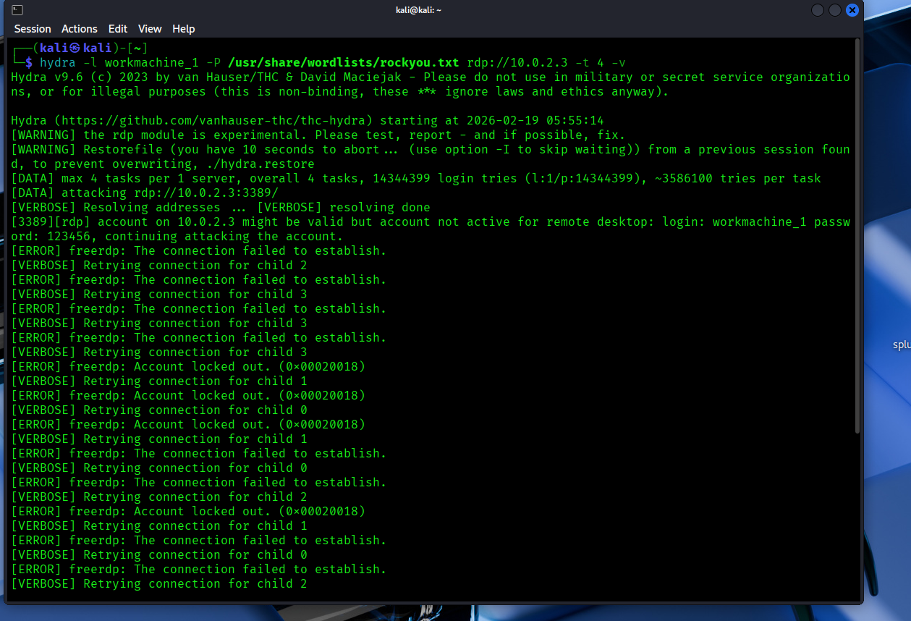

# SOC Splunk Lab

## 📌 Project Overview
This project demonstrates building a SOC Home Lab using Splunk Enterprise to detect and investigate brute force attacks against a Windows machine.

## 🏗️ Lab Architecture
- SIEM: Splunk Enterprise (Ubuntu Server)
- Victim Machine: Windows 11
- Attacker Machine: Kali Linux

## 🎯 Use Case 001
Detection of multiple failed login attempts (Event ID 4625)

---

## Lab Architecture Diagram

## RDP Brute Force Detection

## Splunk Detection (RDP Brute Force)(screenshots/rdp_bruteforce_detection.png)

## Kali Attack Simulation

## Incident Report

Read the detailed report here: [RDP BruteForce Report](RDP-BruteForce-Report.md)

