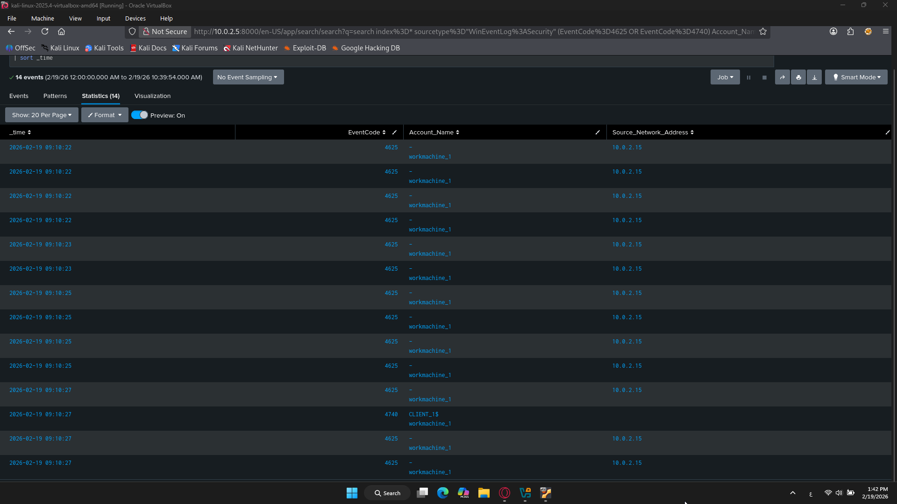

# SOC Splunk Lab

## Project Overview
This project shows a SOC Home Lab using Splunk Enterprise to detect brute force attacks on a Windows machine.

## Lab Architecture
- SIEM: Splunk Enterprise (Ubuntu Server)
- Victim Machine: Windows 11
- Attacker Machine: Kali Linux

## Lab Diagram

## Splunk Detection

## Kali Attack Simulation

## Incident Report

See the detailed report here: [RDP-BruteForce Report](RDP-BruteForce-Report.md)
